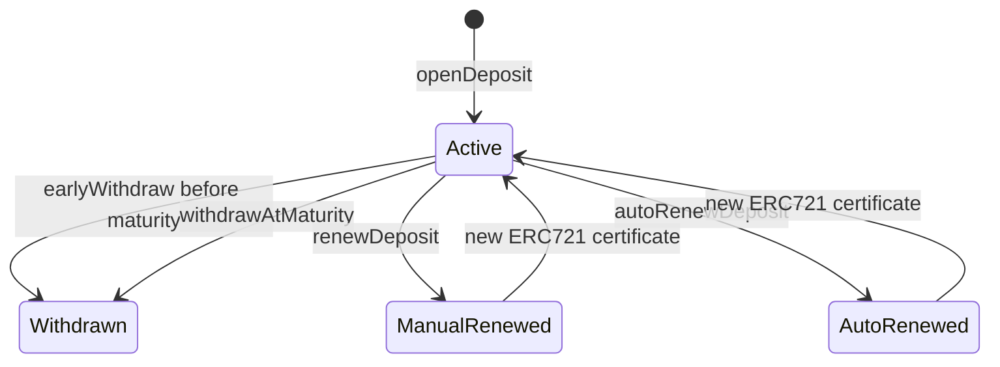

# BLOCKCHAIN ONLINE BANKING SYSTEM

A modular Ethereum term-deposit banking DApp built with Solidity, Hardhat, React, TypeScript, ethers v6, and MetaMask.

> **Repository status:** Complete and demo-ready. Smart contracts, automated tests, coverage, Sepolia deployment support, the React frontend, the owner administration dashboard, certificate lifecycle features, and the automated Hardhat Localhost demo workflow are implemented.

---

## Student Information

| Field | Value |
|---|---|
| Full Name | **Nguyen Lam** |
| Student ID | **2231200021** |
| Project | **Blockchain Online Banking System** |
| Primary Use Case | Tokenized term deposits with ERC721 deposit certificates |

> Review the full name before final submission and replace it if the official school record uses a different spelling.

### Personal Variant Configuration

The project parameters derived from Student ID `2231200021` are:

| Parameter | Value | Contract Representation |
|---|---:|---:|
| Grace Period | 3 days | `3 days` |
| Default APR | 2.25% | `225` bps |
| Early Withdrawal Penalty | 4.00% | `400` bps |
| Default Tenor | 90 days | `90` days |
| MockUSDC Decimals | 6 | `10^6` base units |

These parameters are used by the default deployment plan and the contract test suite.

---

## Table of Contents

- [Project Overview](#project-overview)
- [Key Features](#key-features)
- [System Architecture](#system-architecture)
- [Separation of Funds](#separation-of-funds)
- [Smart Contracts](#smart-contracts)
- [Deposit Lifecycle](#deposit-lifecycle)
- [Creative Challenges](#creative-challenges)
- [Seven Structural Design Answers](#seven-structural-design-answers)
- [Technology Stack](#technology-stack)
- [Repository Structure](#repository-structure)
- [Installation](#installation)
- [Testing and Coverage](#testing-and-coverage)
- [Local Demo](#local-demo)
- [Frontend](#frontend)
- [Sepolia Deployment](#sepolia-deployment)
- [Security and Scope Notes](#security-and-scope-notes)
- [Demo Video](#demo-video)
- [Documentation](#documentation)
- [License](#license)

---

## Project Overview

The Blockchain Online Banking System models a bank term-deposit product using three independent smart contracts:

- `MockUSDC` provides a 6-decimal ERC20 test currency.
- `SavingCore` manages saving plans, accepts user principal, and represents each deposit as an ERC721 certificate.
- `VaultManager` holds the bank-funded interest reserve and protects promised interest obligations.

The React frontend allows a MetaMask user to:

- connect a wallet;
- view MockUSDC balance and deposit summaries;
- browse saving plans;
- approve and open deposits;
- view owned deposit certificates;
- withdraw early with a penalty;
- withdraw principal and interest at maturity;
- renew a matured deposit into a new certificate;
- claim deferred interest after the vault is replenished;
- open a dedicated deposit-certificate detail page;
- transfer an ERC721 deposit certificate to another wallet;
- manually renew into a selected enabled plan and observe bot-triggered auto-renewal after the grace deadline;
- run the complete workflow on Sepolia or Hardhat Localhost.

The owner administration interface additionally supports plan management, vault funding and excess withdrawal, pause controls, fee-receiver configuration, and solvency monitoring.

---

## Key Features

### User Features

- MetaMask wallet connection
- Account and network change detection
- Wrong-network and disconnected-wallet states
- MockUSDC balance display using 6 decimals
- Saving-plan discovery
- Allowance-aware `approve → openDeposit` flow
- ERC721 deposit certificate ownership checks
- Early withdrawal
- Mature withdrawal
- Manual renewal
- Pending-interest balance and claim flow
- Dedicated deposit-certificate detail page
- Certificate transfer between wallets
- Manual renewal with plan selection and bot-triggered automatic renewal
- Blockchain-time-based maturity detection
- Readable transaction and contract errors
- Responsive banking dashboard UI

### Administration Features

- Owner-wallet verification
- Vault balance, promised-interest, and excess-liquidity summaries
- Vault funding with allowance-aware approval
- C2-protected excess-liquidity withdrawal
- Pause and unpause controls
- Saving-plan creation
- APR updates for future deposits
- Plan enable and disable controls
- On-chain fee-receiver address updates
- Browser-local display name for the penalty receiver

### Contract Features

- Admin-managed saving plans
- APR and penalty snapshots at deposit opening
- Transferable ERC721 deposit certificates
- Separate principal and interest pools
- Pause and unpause controls
- C1 deferred-interest recovery
- C2 solvency guard
- Manual renewal into a selected enabled plan
- Bot-triggered auto-renewal at or after the grace deadline
- Historical certificate status transitions with a newly minted active certificate
- Promised-interest accounting
- Reentrancy protection on external financial entry points

---

## System Architecture


### Why Three Contracts?

The contracts are intentionally decoupled:

1. **MockUSDC** isolates token behavior from banking logic.
2. **SavingCore** owns the deposit lifecycle and user principal.
3. **VaultManager** owns the interest reserve and bank solvency rules.

This design reduces responsibility overlap, makes contract balances auditable, and prevents bank-funded interest liquidity from being mixed with customer principal.

---

## Separation of Funds

The system structurally separates two financial pools.

### Principal Pool

User principal is transferred to:

```solidity
address(SavingCore)
```

when `openDeposit` executes.

At maturity, principal is always returned directly from `SavingCore`:

```solidity
usdcToken.safeTransfer(msg.sender, principal);
```

### Interest Pool

The bank or contract owner funds:

```solidity
address(VaultManager)
```

through `fundVault`.

Interest is paid only through:

```solidity
vaultManager.payInterest(receiver, amount);
```

### Structural Proof

| Fund Type | Holding Contract | Deposit Source | Payment Destination |
|---|---|---|---|
| User principal | `SavingCore` | Depositor | Depositor or renewed deposit |
| Bank interest reserve | `VaultManager` | Contract owner | Depositor or `SavingCore` during renewal |
| Early-withdrawal penalty | Fee receiver | Deducted from principal | Configured fee receiver |

`SavingCore` cannot use principal as bank interest liquidity. `VaultManager` does not custody the user's principal. Their token balances are independent and can be inspected separately on-chain.

---

## Smart Contracts

### `MockUSDC.sol`

A test ERC20 token with:

- name: `Mock USDC`;
- symbol: `mUSDC`;
- 6 decimals;
- public minting for testing and demonstration.

> `MockUSDC` is not production USDC and has no real monetary value.

### `VaultManager.sol`

Responsibilities:

- hold the interest reserve;
- configure the fee receiver;
- authorize `SavingCore`;
- pause and unpause guarded operations;
- fund and withdraw vault liquidity;
- track `totalPromisedInterest`;
- allocate, cancel, and pay interest;
- block owner withdrawals that would violate solvency.

### `SavingCore.sol`

Responsibilities:

- create, update, enable, and disable plans;
- accept principal;
- snapshot plan terms;
- calculate expected interest;
- mint ERC721 deposit certificates;
- process early and mature withdrawals;
- defer unpaid interest;
- support pending-interest claims;
- support manual renewal into a selected plan and permissionless bot-triggered automatic renewal;
- protect external financial entry points with `ReentrancyGuard`.

### Deposit Statuses

```solidity
enum DepositStatus {
    Active,
    Withdrawn,
    ManualRenewed,
    AutoRenewed
}
```

---

## Deposit Lifecycle



### Open Deposit

1. User selects an enabled plan.
2. Frontend validates min/max and 6-decimal precision.
3. Frontend checks the user's MockUSDC balance.
4. Frontend checks current allowance.
5. Approval is sent only when allowance is insufficient.
6. `SavingCore.openDeposit(planId, amount)` transfers principal.
7. APR and penalty are snapshotted.
8. Expected interest is allocated in `VaultManager`.
9. A new ERC721 certificate is minted to the user.

### Early Withdrawal

Before maturity:

- no interest is paid;
- penalty is calculated from the snapshotted penalty BPS;
- remaining principal is returned;
- penalty is transferred to the fee receiver;
- promised interest is cancelled in `VaultManager`.

### Mature Withdrawal

At or after maturity:

- principal is returned from `SavingCore`;
- interest is requested from `VaultManager`;
- if interest cannot be paid, principal still succeeds and interest becomes pending under C1.

### Manual Renewal

From maturity through the grace deadline, inclusive:

- only the current ERC721 owner may call `renewDeposit(depositId, newPlanId)`;
- `newPlanId` must exist and remain enabled;
- the old certificate becomes `ManualRenewed`;
- matured interest is paid from `VaultManager` to `SavingCore`;
- new principal becomes `old principal + matured interest`;
- a new active certificate is minted to the current owner;
- the new certificate snapshots the selected plan's current tenor, APR, and early-withdrawal penalty;
- the old promised-interest obligation is replaced by the new certificate's obligation.

### Automatic Renewal

At or after `maturityAt + GRACE_PERIOD`, any caller may trigger `autoRenewDeposit(depositId)` for an active matured certificate. A local bot scans eligible certificates and submits the transaction.

- the old certificate becomes `AutoRenewed`;
- a new active certificate is minted to the current ERC721 owner;
- the renewed principal is `old principal + matured interest`;
- the new certificate preserves the old certificate's plan ID, tenor, APR snapshot, and penalty snapshot;
- the old certificate remains on-chain as lifecycle history.

At the exact grace deadline, manual actions and auto-renewal are both initially eligible. Only the first confirmed transaction succeeds because it changes the old certificate away from `Active`.

---

## Creative Challenges

## C1 — Principal Safety

### Problem

A bank interest vault may temporarily lack enough liquidity to pay promised interest. A naive implementation could revert the entire withdrawal, trapping the user's principal.

### Design

`withdrawAtMaturity` returns principal first:

```solidity
usdcToken.safeTransfer(msg.sender, principal);
```

It then attempts interest payment using `try/catch`:

```solidity
try vaultManager.payInterest(msg.sender, interest) {
    interestPaid = interest;
} catch {
    pendingInterest[msg.sender] += interest;
    emit InterestDeferred(depositId, msg.sender, interest);
}
```

### Result

- principal is never blocked by temporary interest insolvency;
- unpaid interest is recorded per user;
- the user may call `claimPendingInterest()` after the vault is funded;
- the promised-interest obligation remains tracked.

This satisfies the principal-safety requirement without silently forgiving the bank's debt.

---

## C2 — Solvency Guard

### Problem

The owner must not withdraw interest liquidity already promised to active deposits.

### Design

When a deposit opens:

```solidity
vaultManager.allocateInterest(expectedInterest);
```

`VaultManager` tracks:

```solidity
uint256 public totalPromisedInterest;
```

Owner withdrawal is allowed only when the post-withdrawal balance remains sufficient:

```solidity
require(
    currentBalance - amount >= totalPromisedInterest,
    "VaultManager: cannot withdraw promised interest"
);
```

Obligations are reduced only when:

- interest is paid; or
- an early withdrawal cancels the related interest.

### Result

The owner can withdraw only true excess liquidity, while committed interest remains reserved.

---

## Seven Structural Design Answers

### 1. Why is the system split into three contracts?

Each contract has one financial responsibility. `MockUSDC` is the currency, `SavingCore` manages customer deposits and principal, and `VaultManager` manages bank-funded interest. This separation improves auditability and prevents accidental fund mixing.

### 2. Why is each deposit represented as an ERC721 certificate?

A deposit is a unique financial position with its own principal, plan, opening time, maturity, APR snapshot, penalty snapshot, and status. ERC721 provides a unique token ID and standard ownership semantics. Withdrawal and renewal authorization follows `ownerOf(depositId)`, so rights follow the current certificate owner.

### 3. Why are APR and penalty snapshotted?

Plan terms may change after a deposit opens. Snapshotting prevents retroactive changes from modifying an existing customer's agreement. Automatic renewal preserves the old certificate's snapshots, while manual renewal intentionally snapshots the selected new plan's current terms.

### 4. How is user principal protected from vault insolvency?

Principal is held in `SavingCore`, not `VaultManager`. Mature withdrawal transfers principal before attempting interest payment. If the interest payment fails, C1 records `pendingInterest` instead of reverting the principal transfer.

### 5. How does the system prevent the owner from withdrawing promised interest?

C2 records every active deposit's expected interest in `totalPromisedInterest`. `withdrawVault` requires the remaining vault balance to be at least that amount. This makes promised interest a measurable on-chain liability.

### 6. How are early withdrawal, mature withdrawal, and renewal kept mutually exclusive?

Every action requires `DepositStatus.Active`. The selected action changes the old certificate status to `Withdrawn`, `ManualRenewed`, or `AutoRenewed`. Later attempts fail because the deposit is no longer active. Time checks separately enforce pre-maturity versus post-maturity actions.

### 7. How do pause control, grace period, and ownership affect operations?

`VaultManager.paused()` currently blocks deposit opening, withdrawals, renewals, bot-triggered auto-renewal, interest payment, vault funding, and pending-interest claims. Manual actions require the caller to own the certificate. Auto-renewal resolves the current ERC721 owner and becomes eligible at `maturityAt + GRACE_PERIOD`.

> **Planned hardening:** allow the owner to add vault liquidity while paused, while keeping user actions, renewal, interest claims, and vault withdrawals blocked until `unpause()`.

---

## Technology Stack

### Smart Contracts

- Solidity `0.8.28`
- OpenZeppelin Contracts
- Hardhat `2.x`
- ethers v6
- TypeScript
- Chai
- `solidity-coverage`
- TypeChain
- Hardhat Contract Sizer

### Frontend

- React `18`
- TypeScript
- Vite
- Tailwind CSS
- ethers v6
- React Router
- lucide-react
- MetaMask

---

## Repository Structure

```text
.
├── contracts/
│   ├── MockUSDC.sol
│   ├── SavingCore.sol
│   └── VaultManager.sol
├── scripts/
│   ├── deploy.ts
│   ├── setup-local-demo.ts
│   ├── advance-local-time.ts
│   └── auto-renew-bot.ts
├── test/
│   ├── MockUSDC.test.ts
│   ├── SavingCore.test.ts
│   └── VaultManager.test.ts
├── frontend/
│   ├── src/
│   ├── .env.example
│   └── package.json
├── docs/
│   ├── LOCAL_DEMO.md
│   ├── planning/
│   └── progress/
├── hardhat.config.ts
├── package.json
└── README.md
```

---

## Installation

### Prerequisites

- Node.js 18 or newer
- npm 9 or newer
- MetaMask browser extension
- Git

### Clone and Install Root Dependencies

```bash
git clone https://github.com/nguyenlam-eiu/ac-blockchain-online-banking-system.git
cd ac-blockchain-online-banking-system
npm install
```

### Install Frontend Dependencies

```bash
cd frontend
npm install
cd ..
```

### Compile Contracts

```bash
npm run compile
```

---

## Testing and Coverage

### Run All Contract Tests

```bash
npx hardhat test
```

or:

```bash
npm test
```

### Run Coverage

```bash
npx hardhat coverage
```

Generated reports:

```text
coverage/index.html
coverage.json
lcov.info
```

These artifacts are generated locally and are not committed.

### Verified Coverage Benchmark

The Day 6 coverage run recorded:

| Contract | Statements | Branches | Functions | Lines |
|---|---:|---:|---:|---:|
| `MockUSDC.sol` | 100% | 100% | 100% | 100% |
| `SavingCore.sol` | 100% | 95.12% | 100% | 100% |
| `VaultManager.sol` | 100% | 90% | 100% | 100% |
| **All files** | **100%** | **93.44%** | **100%** | **100%** |

**Recorded coverage-run test result:** `65 passing`, `0 failing`. The current suite has since been expanded with renewal, ownership-transfer, exact-boundary, and transaction-ordering tests; run `npx hardhat test` for the current count.

> The project exceeds the assignment's 90% coverage requirement across the aggregate statement, branch, function, and line metrics.

---

## Local Demo

The project includes an automated localhost workflow.

### Terminal 1 — Start Hardhat Node

From the repository root:

```bash
npm run node:local
```

Keep this terminal running.

### Terminal 2 — Deploy and Prepare Demo State

```bash
npm run demo:setup
```

The setup script:

- deploys all three contracts;
- wires `SavingCore` into `VaultManager`;
- mints 10,000 MockUSDC to Hardhat Account #0;
- funds the vault with 100,000 MockUSDC;
- creates a one-day demo plan;
- verifies on-chain state;
- generates `frontend/.env.local`.

### Terminal 3 — Start Frontend

```bash
cd frontend
npm run dev
```

Open:

```text
http://localhost:5173
```

### MetaMask Local Network

| Field | Value |
|---|---|
| Network Name | Hardhat Localhost |
| RPC URL | `http://127.0.0.1:8545` |
| Chain ID | `31337` |
| Currency Symbol | `ETH` |

Import Hardhat Account #0 using the development-only private key printed by the node.

> Never use Hardhat development private keys on a public network or with real assets.

### Advance Local Blockchain Time

Windows CMD:

```bat
set ADVANCE_DAYS=2
npm run demo:advance
```

macOS/Linux:

```bash
ADVANCE_DAYS=2 npm run demo:advance
```

After advancing time, refresh **My Deposits**. The frontend reads the latest block timestamp rather than the computer's `Date.now()` value.

### Run the Local Auto-Renew Bot

For the one-day demo plan and three-day grace period, advance at least four days. Five days is convenient for demonstration:

Windows PowerShell:

```powershell
$env:ADVANCE_DAYS="5"
npm run demo:advance
npm run bot:auto-renew
```

Windows CMD:

```bat
set ADVANCE_DAYS=5
npm run demo:advance
npm run bot:auto-renew
```

macOS/Linux:

```bash
ADVANCE_DAYS=5 npm run demo:advance
npm run bot:auto-renew
```

The bot:

1. reads `SavingCore` from `frontend/.env.local`;
2. uses the latest block timestamp;
3. scans every certificate from `1` to `nextDepositId - 1`;
4. selects only `Active` certificates where `block.timestamp >= maturityAt + GRACE_PERIOD`;
5. submits and waits for `autoRenewDeposit`;
6. logs the old certificate as `AutoRenewed` and the new certificate as `Active`.

Running the bot again is safe for already processed certificates because they are no longer `Active`.

### Reset Local State

Stop and restart the Hardhat node, then run:

```bash
npm run demo:setup
```

Restart Vite after `.env.local` is regenerated.

See [docs/LOCAL_DEMO.md](docs/LOCAL_DEMO.md) for the complete walkthrough.

---

## Frontend

### Pages

| Page | Purpose |
|---|---|
| Dashboard | Balance, principal, active deposits, pending interest, system status |
| Savings Plans | Plan discovery and open-deposit form |
| My Deposits | Deposit history, maturity information, withdrawal, renewal, and detail links |
| Deposit Detail | Certificate ownership, complete deposit terms, lifecycle actions, manual renewal plan selection, and certificate transfer |
| Administration | Owner-only plan, vault, pause, solvency, and fee-receiver controls |
| Not Found | Fallback route |

### Frontend Environment Variables

The frontend supports environment-aware blockchain configuration:

```env
VITE_CHAIN_ID=
VITE_NETWORK_NAME=
VITE_MOCK_USDC_ADDRESS=
VITE_VAULT_MANAGER_ADDRESS=
VITE_SAVING_CORE_ADDRESS=
```

Use:

```text
frontend/.env.example
```

as the template.

For local demo, `npm run demo:setup` generates:

```text
frontend/.env.local
```

Do not commit `.env.local`. Restart Vite whenever its values change.

### Frontend Commands

```bash
cd frontend
npm run dev
npm run build
npm run preview
```

### Frontend Transaction Rules

- MockUSDC always uses 6 decimals.
- Contract instances are created outside page components.
- Approval is skipped when allowance is already sufficient.
- Buttons are disabled while transactions are pending.
- Localhost transactions do not show Sepolia Etherscan links.
- Deposit maturity uses blockchain block time.
- The penalty receiver address is stored on-chain in `VaultManager`.
- The optional penalty-receiver display name is frontend metadata stored in browser `localStorage`; it is not a `SavingPlan` field and is not part of consensus state.

### Frontend Completion Status

| Area | Status |
|---|---|
| Wallet and network handling | Complete |
| Plan discovery and open deposit | Complete |
| Deposit history and detail | Complete |
| Early and mature withdrawal | Complete |
| Manual renewal | Complete |
| Grace-period auto-renewal | Complete |
| Pending-interest claim | Complete |
| ERC721 certificate transfer | Complete |
| Owner administration dashboard | Complete |
| Vault and solvency controls | Complete |
| Local demo automation | Complete |

---

## Sepolia Deployment

The frontend can also run against Sepolia (`chain ID 11155111`).

Current project deployment:

| Contract | Sepolia Address |
|---|---|
| MockUSDC | `0x7EE15D3D07a923C2B661824B76E2398DC20F9728` |
| VaultManager | `0x2407cCBB5639A41F8A16fda75024a887b90d6C8f` |
| SavingCore | `0xf907D74280d7c2a52397A933CAbEADbFfeC4fc7F` |

### Environment

Create a root `.env` when deploying:

```env
SEPOLIA_RPC_URL=
TESTNET_PRIVATE_KEY=
```

Never commit `.env` or private keys.

### Deploy

```bash
npm run deploy:sepolia
```

Sepolia transactions require test ETH for gas.

---


## Final Project Status

The planned implementation is complete and ready for mentor review and demonstration.

Completed deliverables include:

- three-contract Solidity architecture;
- a passing contract test suite including grace-boundary, transaction-ordering, ownership-transfer, accounting, C1, C2, event, and renewal coverage;
- C1 principal safety with deferred-interest claims;
- C2 promised-interest solvency protection;
- local and Sepolia deployment workflows;
- a complete React and MetaMask user interface;
- deposit opening, ownership discovery, withdrawal, selected-plan manual renewal, bot-triggered auto-renewal, and certificate transfer;
- owner administration for plans, liquidity, pause state, and fee receiver;
- automated localhost setup, blockchain-time advancement, and auto-renew bot execution;
- project architecture, design answers, setup instructions, and demo documentation.

The only submission activity not represented as application code is recording or linking the final demonstration video.

---

## Security and Scope Notes

- This project is an educational demonstration, not production banking software.
- `MockUSDC.mint` is intentionally public for testing.
- No real user identity, KYC, custody, or fiat integration exists.
- The system has not undergone a professional security audit.
- Localhost state disappears when the Hardhat node stops.
- Public-network private keys and RPC credentials must remain outside Git.
- The local bot is an off-chain transaction submitter; smart contracts do not execute automatically when time passes.
- Pause policy currently blocks vault funding and is tracked as a post-demo hardening item.
- Reentrancy protection reduces callback risk but does not replace professional review, monitoring, or production-grade operational controls.

---

## Demo Video

**Required duration:** 3–5 minutes.

**Video link:** [ADD FRONTEND DEMO VIDEO LINK HERE](https://example.com)

The video should demonstrate:

1. starting the local node and setup;
2. connecting MetaMask;
3. viewing Dashboard and Plans;
4. opening two deposits;
5. advancing blockchain time;
6. withdrawing one matured deposit;
7. manually renewing another deposit into a selected enabled plan;
8. opening another deposit, advancing beyond maturity plus grace, and running `npm run bot:auto-renew`;
9. verifying the old certificate is `AutoRenewed` and the newly minted certificate is `Active`;
10. refreshing the application and verifying final state.

> Replace the placeholder link before submission.

---

## Documentation

- [Local Demo Guide](docs/LOCAL_DEMO.md)
- [Project Plan](docs/planning/plan.md)
- [Day 6 Progress and Coverage](docs/progress/day6.md)
- [Frontend README](frontend/README.md), when present

---

## Useful Commands

```bash
# Root
npm install
npm run compile
npm test
npx hardhat coverage
npm run deploy:localhost
npm run deploy:sepolia

# Automated local demo
npm run node:local
npm run demo:setup
npm run demo:advance
npm run bot:auto-renew

# Frontend
cd frontend
npm install
npm run dev
npm run build
npm run preview
```

---

## License

This repository currently uses the `ISC` package license declaration.

---

## Submission Checklist

```text
Smart contracts: Completed
Contract tests: Passing
Aggregate recorded coverage: Above 90%
Grace-boundary and transaction-ordering tests: Passing
NFT ownership-transfer tests: Passing
Frontend ABI and call sites: Verified
React frontend build: Passing
Hardhat Localhost setup: Completed
Auto-renew bot: Completed
Mature withdrawal demo: Passed
Manual selected-plan renewal demo: Passed
Automatic renewal old/new certificate demo: Passed
Pending-interest claim UI: Completed
Owner administration frontend: Completed
Pause-policy hardening: Backlog
Video link: Pending
```
