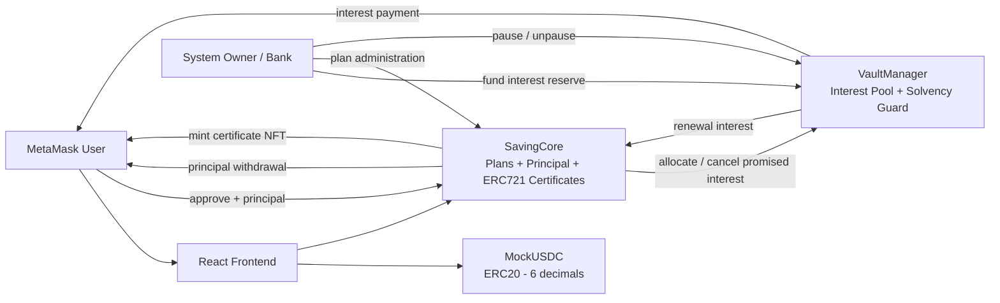
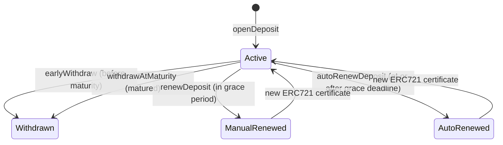

# BLOCKCHAIN ONLINE BANKING SYSTEM

A modular Ethereum term-deposit banking DApp built with Solidity 0.8.28, Hardhat, React 18, TypeScript, ethers v6, Vite, Tailwind CSS, and MetaMask.

---

## Student Information

| Field | Value |
| --- | --- |
| Full Name | **Lam Thoai Binh Nguyen** |
| Student ID | **2231200021** |
| Project | **Blockchain Online Banking System** |
| Primary Use Case | Tokenized term deposits with ERC721 deposit certificates |

### Personal Variant Configuration

The parameters configured in contract code, setup scripts, and tests based on Student ID `2231200021` are:

| Parameter | Value | Contract Representation |
| --- | ---:| ---:|
| Grace Period | 3 days | `3 days` (`259,200` seconds) |
| Default Plan APR | 2.25% | `225` bps |
| Early Withdrawal Penalty | 4.00% | `400` bps |
| Default Tenor | 90 days | `90` days (`7,776,000` seconds) |
| MockUSDC Decimals | 6 | `6` decimals (`10^6` base units) |

---

## Table of Contents

- [Project Overview](#project-overview)
- [Core Features](#core-features)
- [Architecture](#architecture)
- [Smart Contracts](#smart-contracts)
- [Separation of Principal and Interest](#separation-of-principal-and-interest)
- [Deposit Certificate and Ownership Model](#deposit-certificate-and-ownership-model)
- [Deposit Lifecycle](#deposit-lifecycle)
- [Manual Renewal](#manual-renewal)
- [Auto-Renewal and Off-Chain Bot](#auto-renewal-and-off-chain-bot)
- [Grace-Period Boundary Rules](#grace-period-boundary-rules)
- [C1 Principal Safety](#c1-principal-safety)
- [C2 Solvency Guard](#c2-solvency-guard)
- [Pause Policy](#pause-policy)
- [Security Protections and Limitations](#security-protections-and-limitations)
- [Technology Stack](#technology-stack)
- [Repository Structure](#repository-structure)
- [Installation](#installation)
- [Environment Variables](#environment-variables)
- [Compile, Test, and Frontend Build](#compile-test-and-frontend-build)
- [Local Demo](#local-demo)
- [Advancing Blockchain Time](#advancing-blockchain-time)
- [Auto-Renew Bot](#auto-renew-bot)
- [Frontend Capabilities](#frontend-capabilities)
- [Sepolia Deployment](#sepolia-deployment)
- [Design Answers](#design-answers)
- [Useful Commands](#useful-commands)
- [Final Verification Status](#final-verification-status)
- [License](#license)

---

## Project Overview

The Blockchain Online Banking System models a commercial bank term-deposit product using three decoupled smart contracts:

- **`MockUSDC.sol`**: Provides a 6-decimal ERC20 test currency.
- **`SavingCore.sol`**: Manages savings plans, holds user principal, and issues transferable ERC721 deposit certificates.
- **`VaultManager.sol`**: Holds the bank-funded interest reserve and enforces solvency protection on promised interest obligations.

A React frontend connected via MetaMask allows depositors to manage term deposits and certificate NFTs, while providing bank administrators with plan management, vault liquidity controls, and solvency tracking.

---

## Core Features

### User Features

- **Wallet Integration**: MetaMask wallet connection, network detection, and account change listeners.
- **Token Formatting**: 6-decimal safe formatting for all MockUSDC values.
- **Plan Discovery**: Browse enabled saving plans with APR, tenor, limits, and penalty terms.
- **Deposit Opening**: Allowance-aware approval flow (`approve` $\rightarrow$ `openDeposit`) minting an ERC721 certificate NFT.
- **Certificate Portfolio**: View owned deposit certificates, active statuses, maturity dates, and accrued expected interest.
- **Early Withdrawal**: Early exit prior to maturity returning principal minus penalty (penalty sent to `feeReceiver`).
- **Mature Withdrawal**: Complete withdrawal of principal from `SavingCore` and interest from `VaultManager` upon maturity.
- **Manual Renewal**: Renew matured deposits during the grace period into a selected enabled plan, minting a new certificate.
- **Deferred Interest Claiming**: Claim pending interest accumulated under C1 Principal Safety once the vault is replenished.
- **Certificate Transfer**: Transfer certificate NFTs to other wallets; withdrawal and renewal rights automatically follow the current owner.
- **Certificate Detail Page**: Dedicated view showing full certificate metadata, lifecycle history, transfer tools, and renewal plan selection.

### Administration Features

- **Owner Access Control**: Dedicated Admin view restricted to contract owner wallet.
- **Plan Management**: Create plans, update future APRs, and enable or disable plans.
- **Vault Liquidity**: Fund interest reserve and withdraw surplus unallocated USDC while respecting Solvency Guard (C2).
- **Pause Control**: System-wide emergency pause and unpause functionality.
- **Fee Destination**: Configure the on-chain `feeReceiver` address for early withdrawal penalties.

---

## Architecture



---

## Smart Contracts

### `MockUSDC.sol`
- **Type**: Standard ERC20 Token.
- **Decimals**: Fixed 6 decimals (`decimals() returns 6`).
- **Minting**: Public `mint(address to, uint256 amount)` for testing and local demonstration setup.

### `VaultManager.sol`
- **Inheritance**: OpenZeppelin `Ownable`, `Pausable`.
- **Responsibilities**:
  - Holds bank-funded interest liquidity.
  - Manages `feeReceiver` address receiving early withdrawal penalties.
  - Authorizes `SavingCore` address via `setSavingCore(address)`.
  - Tracks `totalPromisedInterest` committed to active deposits.
  - Enforces Solvency Guard (C2): Owner `withdrawVault` requires `currentBalance - amount >= totalPromisedInterest`.

### `SavingCore.sol`
- **Inheritance**: OpenZeppelin `ERC721("Deposit Certificate", "DEPOSIT")`, `Ownable`, `ReentrancyGuard`.
- **Responsibilities**:
  - Holds user principal tokens.
  - Manages saving plan definitions (`SavingPlan` struct).
  - Calculates interest using `_calculateInterest(principal, aprBps, tenorSeconds)`.
  - Issues transferable ERC721 deposit certificate NFTs (`DepositCertificate` struct).
  - Handles mature withdrawal, C1 deferred interest, early withdrawal penalty routing, manual renewal into a selected plan, and permissionless auto-renewal.

---

## Separation of Principal and Interest

User principal and bank interest reserves are strictly segregated into separate contracts:

| Reserve Type | Holding Contract | Source | Destination |
| --- | --- | --- | --- |
| **User Principal** | `SavingCore` | Depositor (`safeTransferFrom`) | Depositor on withdrawal, or `SavingCore` on renewal |
| **Bank Interest Liquidity** | `VaultManager` | Owner (`fundVault`) | Depositor on mature withdrawal, or `SavingCore` on renewal |
| **Early Withdrawal Penalty** | `VaultManager.feeReceiver` | Deducted from principal | Configured `feeReceiver` address |

- `SavingCore` never uses customer principal to pay bank interest.
- `VaultManager` never holds customer principal.
- Token balances are completely independent and auditable on-chain.

---

## Deposit Certificate and Ownership Model

Each deposit position is represented as a unique ERC721 non-fungible token (NFT):

```solidity
enum DepositStatus {
    Active,
    Withdrawn,
    ManualRenewed,
    AutoRenewed
}
```

- **Ownership Gate**: Withdrawal (`withdrawAtMaturity`, `earlyWithdraw`) and manual renewal (`renewDeposit`) check `ownerOf(depositId) == msg.sender`.
- **Transferability**: Standard ERC721 `transferFrom` transfers certificate ownership. Upon transfer, the previous owner loses action rights and the new owner gains them.
- **Audit History**: `SavingCore` never calls `_burn`. When a deposit is withdrawn or renewed, its existing ERC721 token is **retained** and its `DepositCertificate` mapping record remains. Only the `status` field changes: `Withdrawn`, `ManualRenewed`, or `AutoRenewed`. A certificate with any of these statuses cannot perform active financial actions. For renewals, a new `Active` certificate NFT is minted to the current owner.

---

## Deposit Lifecycle



### 1. `openDeposit(uint256 planId, uint256 amount)`
- Requires system is not paused and plan is enabled.
- Validates `amount` against plan `minDeposit` and `maxDeposit`.
- Transfers principal from depositor to `SavingCore`.
- Calculates expected interest using internal helper `_calculateInterest`:
  $$\text{expectedInterest} = \frac{\text{principal} \times \text{aprBps} \times \text{tenorSeconds}}{\text{BPS\_DENOMINATOR} \times \text{SECONDS\_PER\_YEAR}}$$
  *(where `BPS_DENOMINATOR = 10_000` and `SECONDS_PER_YEAR = 365 days`)*.
- Creates `DepositCertificate` snapshotting `aprBps` and `earlyWithdrawPenaltyBps`.
- Calls `vaultManager.allocateInterest(expectedInterest)` to register promised interest under C2.
- Mints a new deposit certificate NFT to `msg.sender`.

### 2. `earlyWithdraw(uint256 depositId)`
- Requires caller is `ownerOf(depositId)`, status is `Active`, and `block.timestamp < maturityAt`.
- Status changes to `Withdrawn`.
- Penalty calculated: $\text{penaltyAmount} = \frac{\text{principal} \times \text{earlyWithdrawPenaltyBpsAtOpen}}{10,000}$.
- Returns remaining principal ($\text{principal} - \text{penaltyAmount}$) to caller.
- Transfers `penaltyAmount` to `vaultManager.feeReceiver()`.
- Calls `vaultManager.cancelInterest(expectedInterest)` to release C2 promised interest.

### 3. `withdrawAtMaturity(uint256 depositId)`
- Requires caller is `ownerOf(depositId)`, status is `Active`, `block.timestamp >= maturityAt`, and `block.timestamp <= maturityAt + GRACE_PERIOD`.
- Status changes to `Withdrawn`.
- Principal is transferred from `SavingCore` to caller.
- Attempts interest payment via `try vaultManager.payInterest(msg.sender, interest)`.
- **C1 Safety**: If `payInterest` reverts (vault insolvent), principal withdrawal still completes, and unpaid interest is recorded in `pendingInterest[msg.sender]`.

---

## Manual Renewal

**Signature**: `renewDeposit(uint256 depositId, uint256 newPlanId)`

- **Authorization**: Caller must be `ownerOf(depositId)`.
- **Eligibility**: Deposit status must be `Active`, `block.timestamp >= maturityAt`, and `block.timestamp <= maturityAt + GRACE_PERIOD`.
- **Plan Selection**: Target `newPlanId` must exist and be enabled. Manual renewal snapshots the selected plan's tenor, APR, and early withdrawal penalty.
- **Financial Flow**:
  1. Old deposit status changes to `ManualRenewed`.
  2. Matured interest is paid from `VaultManager` to `SavingCore` via `vaultManager.payInterest(address(this), interest)`.
  3. New principal is set to $\text{oldPrincipal} + \text{maturedInterest}$.
  4. A new active deposit certificate is created with new expected interest calculated for `newPlanId`.
  5. Calls `vaultManager.allocateInterest(newExpectedInterest)` for C2 solvency tracking.
  6. Mints a new ERC721 certificate NFT to `msg.sender`.

---

## Auto-Renewal and Off-Chain Bot

**Signature**: `autoRenewDeposit(uint256 depositId)`

- **Authorization**: Permissionless (callable by anyone, including the off-chain keeper bot).
- **Eligibility**: Deposit status must be `Active` and `block.timestamp >= maturityAt + GRACE_PERIOD`.
- **Ownership Resolution**: Evaluates `address depositOwner = ownerOf(depositId)` at execution time and mints the renewed certificate NFT to the current owner.
- **Preserved Terms**: Preserves the old deposit's plan ID, tenor, snapshotted APR, and snapshotted penalty rate to protect users against rate decreases during automatic rollover.
- **Financial Flow**:
  1. Old deposit status changes to `AutoRenewed`.
  2. Matured interest is paid from `VaultManager` to `SavingCore`.
  3. New principal becomes $\text{oldPrincipal} + \text{maturedInterest}$.
  4. Mints a new active ERC721 certificate NFT to `depositOwner`.
  5. Allocates new promised interest in `VaultManager`.

### Off-Chain Automation Model
Smart contracts do not execute by themselves. The local auto-renew bot (`scripts/auto-renew-bot.ts`) represents an off-chain keeper service. When launched via `npm run bot:auto-renew`, it runs a continuous 5-second polling loop that scans for eligible certificates and submits `autoRenewDeposit` transactions. In a production deployment, this script can be executed periodically via cron, a dedicated worker, Chainlink Automation, or Gelato.

---

## Grace-Period Boundary Rules

The time conditions in `SavingCore.sol` enforce strict state exclusivity:

| Time Phase | `block.timestamp` Condition | Eligible Actions |
| --- | --- | --- |
| **Pre-Maturity** | `block.timestamp < maturityAt` | `earlyWithdraw` |
| **Matured (Grace Period)** | `block.timestamp >= maturityAt` and `block.timestamp <= maturityAt + GRACE_PERIOD` | `withdrawAtMaturity`, `renewDeposit` (manual) |
| **At or After Grace Deadline** | `block.timestamp >= maturityAt + GRACE_PERIOD` | `autoRenewDeposit` |

### Exact Grace Deadline Behavior (`maturityAt + GRACE_PERIOD`)
At the exact boundary `block.timestamp == maturityAt + GRACE_PERIOD`:
- Manual withdrawal/renewal (`<=`) and auto-renewal (`>=`) are both time-eligible because `block.timestamp >= maturityAt + GRACE_PERIOD` is satisfied at the exact deadline as well as at any time thereafter.
- Whichever transaction confirms first changes the deposit status from `Active` to `Withdrawn`, `ManualRenewed`, or `AutoRenewed`.
- The second transaction will revert with `"SavingCore: deposit not active"` because the status is no longer `Active`.

---

## C1 Principal Safety

- **Problem**: Vault liquidity shortages must never lock user principal.
- **Implementation**: `withdrawAtMaturity` transfers principal from `SavingCore` before attempting interest payment. If `vaultManager.payInterest` fails, the exception is caught, principal transfer succeeds, and unpaid interest is deferred to `pendingInterest[user]`.
- **Claiming**: Deferred interest can be claimed later by calling `claimPendingInterest()` once `VaultManager` is funded.

---

## C2 Solvency Guard

- **Problem**: Admin must not withdraw vault funds committed to active deposit interest.
- **Implementation**: `VaultManager.totalPromisedInterest` accumulates expected interest when deposits open/renew, and decreases when interest is paid or cancelled (via early withdrawal).
- **Enforcement**: Owner `withdrawVault(amount)` enforces `currentBalance - amount >= totalPromisedInterest`.

---

## Pause Policy

System operations query `vaultManager.paused()`:

| Caller | Operation | Implemented Paused Behavior |
| --- | --- | --- |
| **User** | `openDeposit`, `withdrawAtMaturity`, `earlyWithdraw`, `renewDeposit`, `claimPendingInterest` | Blocked (`SavingCore: system is paused`) |
| **Bot** | `autoRenewDeposit` | Blocked (`SavingCore: system is paused`) |
| **Admin** | `fundVault`, `withdrawVault`, `payInterest` | Blocked (`whenNotPaused`) |
| **Admin** | `createPlan`, `updatePlan`, `enablePlan`, `disablePlan`, `setFeeReceiver`, `setSavingCore`, `pause`, `unpause` | Allowed |

### Recommended Future Hardening
Allowing owner `fundVault` while paused would enable emergency vault replenishment without resuming public user actions.

---

## Security Protections and Limitations

- **Reentrancy Protection**: OpenZeppelin `ReentrancyGuard` (`nonReentrant` modifier) applied to external financial entry points in `SavingCore.sol`.
- **Safe ERC20 Transfers**: OpenZeppelin `SafeERC20` used for all USDC operations.
- **Access Controls**: OpenZeppelin `Ownable` restricts administrative functions.
- **Limitations**: Single-owner administration model; no timelocks or multisig governance.

---

## Technology Stack

- **Smart Contracts**: Solidity `0.8.28`, Hardhat `2.25.0`, OpenZeppelin Contracts `5.1.0`, TypeChain `0.5.1`, ethers `v6.13.5`.
- **Frontend**: React `18.3.1`, TypeScript `5.6.3`, Vite `5.4.10`, Tailwind CSS `4.3.3`, React Router `6.28.0`, Lucide React `1.25.0`.

---

## Repository Structure

```text
.
├── contracts/
│   ├── MockUSDC.sol
│   ├── SavingCore.sol
│   └── VaultManager.sol
├── scripts/
│   ├── deploy.ts
│   ├── setup-local-demo.ts
│   ├── advance-local-time.ts
│   └── auto-renew-bot.ts
├── test/
│   ├── MockUSDC.test.ts
│   ├── SavingCore.test.ts
│   └── VaultManager.test.ts
├── frontend/
│   ├── src/
│   │   ├── blockchain/
│   │   ├── components/
│   │   ├── context/
│   │   ├── hooks/
│   │   ├── pages/
│   │   └── utils/
│   ├── .env.example
│   └── package.json
├── docs/
│   ├── LOCAL_DEMO.md
│   ├── planning/
│   └── progress/
├── hardhat.config.ts
├── package.json
└── README.md
```

---

## Installation

### 1. Clone Repository & Install Root Dependencies
```bash
git clone https://github.com/nguyenlam-eiu/ac-blockchain-online-banking-system.git
cd ac-blockchain-online-banking-system
npm install
```

### 2. Install Frontend Dependencies
```bash
cd frontend
npm install
cd ..
```

---

## Environment Variables

### Root `.env` (Optional)
```env
REPORT_GAS=1
TESTNET_PRIVATE_KEY=
MAINNET_PRIVATE_KEY=
SEPOLIA_RPC_URL=
```

### Frontend `.env.local` (Generated by `npm run demo:setup`)
```env
VITE_CHAIN_ID=31337
VITE_NETWORK_NAME=Hardhat Localhost
VITE_MOCK_USDC_ADDRESS=0x...
VITE_VAULT_MANAGER_ADDRESS=0x...
VITE_SAVING_CORE_ADDRESS=0x...
```

---

## Compile, Test, and Frontend Build

### Compile Smart Contracts
```bash
npm run compile
```

### Run Unit Test Suite
```bash
npm test
```
- **Latest Passing Test Count**: `118 passing` (0 failing).

### Coverage
```bash
npx hardhat coverage
```
> A previous project progress run recorded coverage above 90% across all metrics, but the latest final audit did not complete a fresh coverage run. Run `npx hardhat coverage` to verify the current result.

### Build Frontend Application
```bash
cd frontend
npm run build
cd ..
```
- **Frontend Build Status**: Built successfully (0 errors).

---

## Local Demo

Running the local demonstration requires three terminal windows:

### Terminal 1: Local Hardhat Node
```bash
npm run node:local
```

### Terminal 2: Setup Local Environment State
```bash
npm run demo:setup
```
Automatically deploys contracts, links permissions, mints test MockUSDC, funds `VaultManager`, creates saving plans, and generates `frontend/.env.local`.

### Terminal 3: Launch Frontend
```bash
cd frontend
npm run dev
```
Navigate to `http://localhost:5173`.

---

## Advancing Blockchain Time

To test maturity and grace period transitions locally without waiting real-world days:

**Windows PowerShell**:
```powershell
$env:ADVANCE_DAYS="2"
npm run demo:advance
```

**Windows CMD**:
```cmd
set ADVANCE_DAYS=2
npm run demo:advance
```

**macOS / Linux**:
```bash
ADVANCE_DAYS=2 npm run demo:advance
```

---

## Auto-Renew Bot

To run the automated background renewal bot on localhost:

```bash
npm run bot:auto-renew
```

The script runs a continuous `while (true)` loop, reads the `SavingCore` address from `frontend/.env.local`, scans deposit IDs 1 through `nextDepositId - 1` every five seconds for `Active` certificates where `block.timestamp >= maturityAt + GRACE_PERIOD`, submits `autoRenewDeposit` for each eligible certificate, waits for transaction confirmation, isolates individual failures, and stops when the operator presses Ctrl+C.

---

## Frontend Capabilities

- **Dashboard**: Account overview, MockUSDC balance, active deposit summary, C1 pending interest indicator and claim button.
- **Plans**: Interactive list of available term deposit plans with open-deposit form.
- **My Deposits**: Certificate portfolio showing status badges, maturity timers, and quick exit actions.
- **Deposit Detail**: Deep view for individual certificate NFTs with manual renewal plan selection and certificate NFT transfer inputs.
- **Administration**: Owner dashboard for plan management, vault funding, surplus liquidity withdrawal, pause toggling, and fee receiver address updates.

---

## Sepolia Deployment

Contracts can be deployed to Sepolia testnet using:

```bash
npm run deploy:sepolia
```

Required environment variables: `TESTNET_PRIVATE_KEY` and `SEPOLIA_RPC_URL`.

> The Hardhat verification plugin (`@nomicfoundation/hardhat-verify`) is installed, but Sepolia contract verification is not currently configured with a valid API key in `hardhat.config.ts`. Verification must be configured separately before deployment.

### Earlier Recorded Sepolia Deployment

> These addresses record a previous Sepolia deployment. Compatibility with the current compiled contracts cannot be confirmed from local source alone.

- `MockUSDC`: `0x7EE15D3D07a923C2B661824B76E2398DC20F9728`
- `VaultManager`: `0x2407cCBB5639A41F8A16fda75024a887b90d6C8f`
- `SavingCore`: `0xf907D74280d7c2a52397A933CAbEADbFfeC4fc7F`

---

## Design Answers

### 1. Transferable Certificate
- **Answer**: Each deposit position is represented by an ERC721 NFT in `SavingCore`. Certificate actions (`withdrawAtMaturity`, `earlyWithdraw`, `renewDeposit`) verify `ownerOf(depositId) == msg.sender`. When an NFT is transferred via standard ERC721 transfer, the new holder becomes the recognized owner and inherits all withdrawal and renewal rights.

### 2. Empty Vault
- **Answer**: C1 Principal Safety guarantees that vault insolvency never traps customer principal. `withdrawAtMaturity` transfers principal from `SavingCore` first. When `vaultManager.payInterest` fails due to insufficient vault funds, the exception is caught, principal payout succeeds, and unpaid interest is credited to `pendingInterest[user]`, which can be claimed later via `claimPendingInterest()`.

### 3. Dead Bot

`autoRenewDeposit` is permissionless, so any address may call it after the grace deadline. If the keeper bot is offline, the deposit remains `Active` and the user's principal and promised interest are not lost.

However, after the grace deadline `block.timestamp >= maturityAt + GRACE_PERIOD`, manual `withdrawAtMaturity` and manual `renewDeposit` are no longer available because their upper-bound check `block.timestamp <= maturityAt + GRACE_PERIOD` now fails. The lifecycle remains blocked until someone submits `autoRenewDeposit(depositId)`. This is a liveness risk rather than an immediate loss-of-funds risk.

A production deployment should use multiple keeper instances or an automation service such as Chainlink Automation or Gelato.

### 4. Rounding Dust

`_calculateInterest` uses:

```
(principal * aprBps * tenorSeconds) / (BPS_DENOMINATOR * SECONDS_PER_YEAR)
```

The multiply-before-divide order reduces precision loss. Solidity integer division truncates fractional MockUSDC base units toward zero.

The fractional remainder is never stored or allocated as promised interest. It remains economically uncommitted within the vault balance. Because `expectedInterest`, `totalPromisedInterest`, and the eventual payment all use the same stored integer amount, rounding cannot cause the vault to over-promise interest.

No dedicated rounding-specific test currently exists; the behavior is implicitly exercised by the existing interest equality assertions throughout the test suite.

### 5. Boundary Times

Time conditions in `SavingCore.sol` use exact EVM block timestamps:

- **Pre-maturity** (`block.timestamp < maturityAt`): only `earlyWithdraw` is available.
- **Grace period** (`block.timestamp >= maturityAt` and `block.timestamp <= maturityAt + GRACE_PERIOD`): `withdrawAtMaturity` and `renewDeposit` are available.
- **At or after the grace deadline** (`block.timestamp >= maturityAt + GRACE_PERIOD`): `autoRenewDeposit` is available. The `>=` operator means auto-renew is valid at the exact grace deadline and at any time thereafter.

At the exact grace deadline, manual actions and auto-renew both satisfy their time checks simultaneously. Only the first confirmed transaction succeeds; the second reverts with `"SavingCore: deposit not active"` because the status has already changed away from `Active`.

### 6. Disabled Plan with Active Deposits

Calling `disablePlan(planId)` sets `plan.enabled = false` and immediately blocks new `openDeposit` calls with `"SavingCore: plan is disabled"`. Existing active certificates are not terminated.

- `earlyWithdraw` and `withdrawAtMaturity` proceed normally regardless of whether the original plan is disabled.
- `renewDeposit` requires the **selected target plan** (`newPlanId`) to be enabled; it reverts with `"SavingCore: target plan is disabled"` if the chosen plan is disabled. This means a depositor cannot manually renew into a disabled plan, including their own original plan.
- `autoRenewDeposit` does **not** check `plan.enabled`. It reads tenor, APR, and penalty directly from the old certificate's snapshot fields (`aprBpsAtOpen`, `earlyWithdrawPenaltyBpsAtOpen`, `maturityAt - startAt`) and proceeds regardless of whether the underlying plan has since been disabled.

### 7. Attack Thinking
- **Answer**: Financial entry points in `SavingCore` apply `nonReentrant` modifiers and update deposit status to `Withdrawn`, `ManualRenewed`, or `AutoRenewed` before transferring assets. Solvency Guard (C2) tracks `totalPromisedInterest` in `VaultManager` and blocks owner withdrawals if remaining vault balance falls below promised obligations.

---

## Useful Commands

```bash
# Clean and compile contracts
npm run clean
npm run compile

# Run Hardhat test suite (118 tests)
npm test

# Launch local Hardhat node
npm run node:local

# Execute local demo setup
npm run demo:setup

# Advance local blockchain time
npm run demo:advance

# Launch auto-renew keeper bot
npm run bot:auto-renew

# Build frontend application
cd frontend && npm run build
```

---

## Final Verification Status

- **Smart Contract Compiler**: Solidity 0.8.28 (evm target: paris) — 0 errors.
- **Contract Test Suite**: `118 passing` (0 failing).
- **Frontend Build**: Vite production build complete — 0 errors.
- **Coverage**: Not freshly reverified in the latest audit run. A previous progress-log benchmark recorded >90% across all metrics. Run `npx hardhat coverage` to obtain a current result.

---

## License

This project is licensed under the [ISC License](LICENSE).
